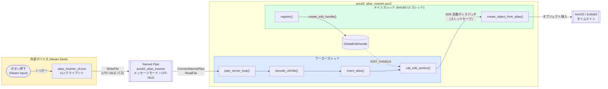
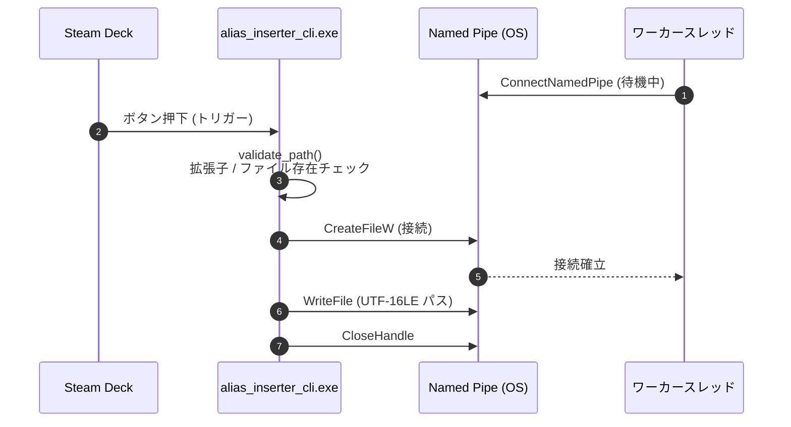
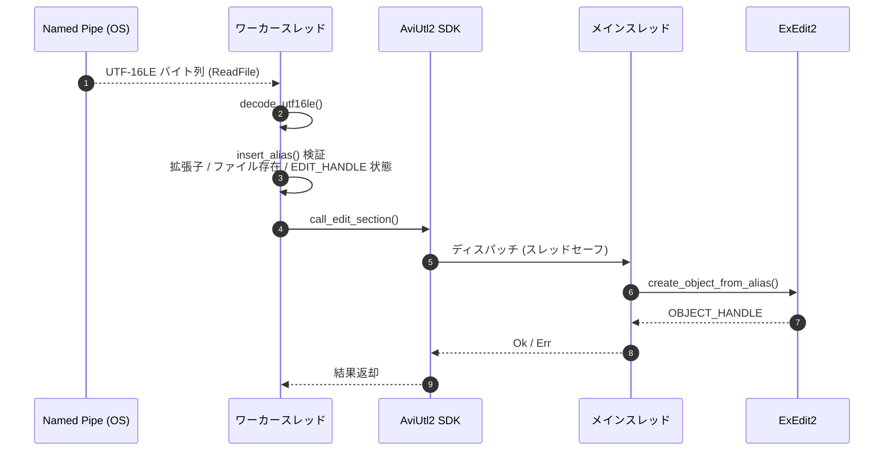
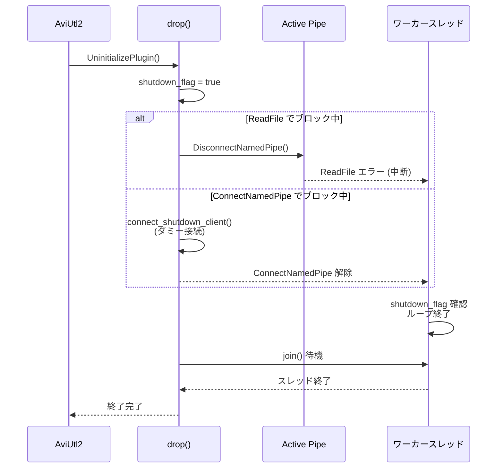

# アーキテクチャ

Named Pipe (`\\.\pipe\aviutl2_alias_inserter`) を介したクライアント・サーバーモデルを採用する。

## システムコンポーネント図

## IPC 接続・送信シーケンス

CLI クライアントがパスを検証し、Named Pipe へ送信するまでのフロー。

## エイリアス挿入シーケンス

ワーカースレッドがデータを受信し、メインスレッドでオブジェクトを挿入するまでのフロー。

## シャットダウンシーケンス

